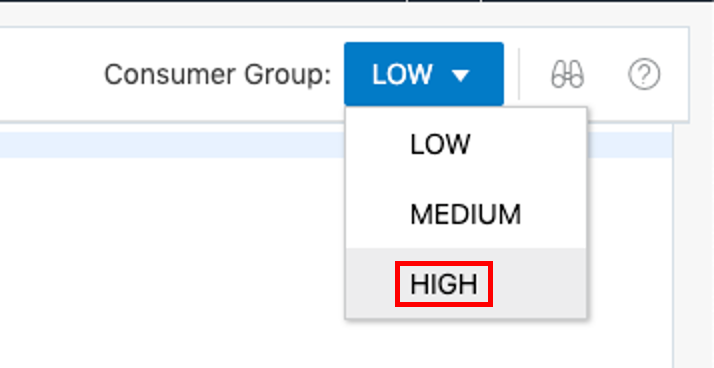

# Analyze data with Oracle SQL

## Introduction

#### Video Preview

[] (youtube:G7fzl4wmcow)

Oracle Database offers the richest SQL language support in the industry. Lean how to use SQL model clause to create custom aggregates and look at your data in different ways. Avoid falling off a complexity cliff by using SQL pattern matching to analyze a series of events. And, use other SQL techniques to find customers that are at risk and much, much more.

In most real-world scenarios, queries against your data warehouse would normally involve the use of a data visualization tool such as Oracle Analytics Cloud (or third-party business intelligence products such as Qlik, Tableau, and PowerBI, currently support Autonomous Data Warehouse). Within this part of the workshop we will use SQL commands to query our data using the built-in SQL Worksheet.  

  >**Note:** Your Autonomous Data Warehouse also comes complete with a built-in machine learning notebook tool which you can launch from the tools menu on the console page. It is aimed at data scientists and data analysts and enables them to build machine learning models using PL/SQL, Python and/or R. This feature is explored in one of our other online labs for Autonomous Data Warehouse.

  *Autonomous Data Warehouse also provides 5 free licenses for Oracle Analytics Desktop, which is the desktop client version of Oracle Analytics Cloud. For more information about Oracle Analytics Cloud, see the [documentation](https://www.oracle.com/uk/business-analytics/analytics-cloud.html)*.

### Prerequisites

- You will need to have completed the earlier labs in this workshop, shown in the Contents menu on the left.

Before starting to run the code in this workshop, we need to manage the resources we are going to use to query our sales data. You will notice that when you open SQL Worksheet, it automatically defaults to using the LOW consumer group - you can see this in the top right section of your worksheet.

  

  >**Note:**: Autonomous Data Warehouse comes complete with three built-in consumer groups for managing workloads. The three groups are: HIGH, MEDIUM, and LOW. Each consumer group is based on predefined CPU/IO shares based on the number of OCPUs assigned to the Autonomous Data Warehouse. The basic characteristics of these consumer groups are:

* HIGH: A high priority connection service for reporting and batch workloads. Workloads run in parallel and are subject to queuing.
* MEDIUM: A typical connection service for reporting and batch workloads. Workloads also run in parallel and are subject to queuing. Using this service the degree of parallelism is limited to 4.
* LOW: A connection service for all other reporting or batch processing workloads. This connection service does not run with parallelism.

For more information about how to use consumer groups to manage concurrency and prioritization of user requests in Autonomous Data Warehouse, please click the following link: [Manage Concurrency and Priorities on Autonomous Database](https://docs.oracle.com/en/cloud/paas/autonomous-database/adbsa/manage-priorities.html#GUID-19175472-D200-445F-897A-F39801B0E953). If you want to explore this topic using a workshop, see the [Managing and Monitoring in Autonomous Database](https://apexapps.oracle.com/pls/apex/dbpm/r/livelabs/view-workshop?wid=618) workshop.

Change the consumer group by simply clicking the downward pointing arrow next to the word LOW, and from the pulldown menu select **HIGH**.

      

### Get started
The next few labs are comprehensive - consisting of many different types of analytic queries. Get started by going to the next lab:  [Analyzying Movie Sales Data](#next).

## Acknowledgements

* **Author** - Keith Laker, Oracle Autonomous Database Product Management
* **Contributors** -  Richard Green, Principal Developer, Database User Assistance
* **Last Updated By/Date** - Keith Laker, August 2, 2021
