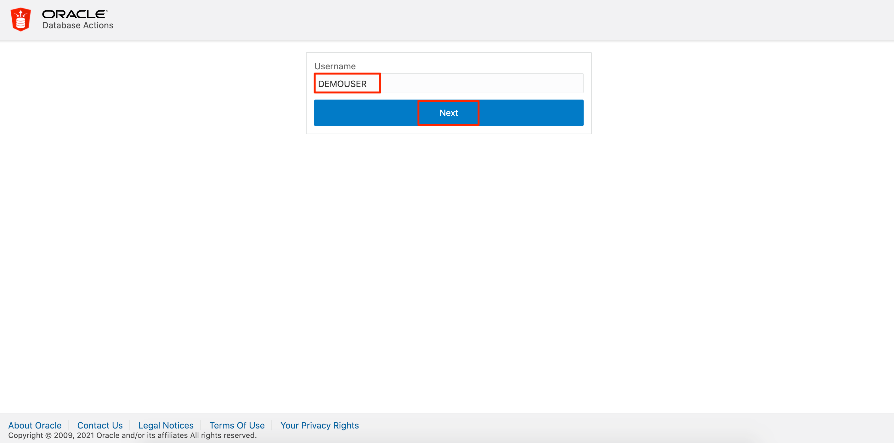
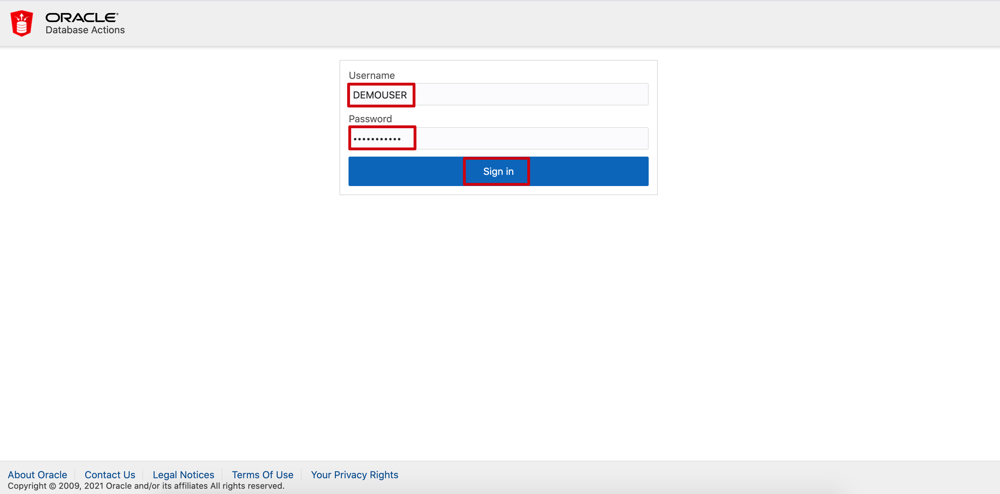

# Provision Oracle Autonomous Database

## Introduction

In this lab, you will provision the Oracle Autonomous Database (ADB) instance and connect to the database as a new user.

Estimated Time: 10 minutes

Watch the video below for a quick walk through of the lab.

[](youtube:dhCPeTAErtY)


### Objectives

In this lab, you will:

- Provision an Oracle Autonomous Transaction Processing (ATP)instance
- Create a new database user using Database Actions
- Connect to Oracle Autonomous Transaction Processing database as a new user from SQL Developer Web

### Prerequisites

This workshop assumes you have:

- Logged in to your own cloud account or a LiveLabs account.

## Task 1: Provision an ATP Instance

1. If you are using a Free Trial or Always Free account, and you want to use Always Free Resources, you need to be in a region where Always Free Resources are available. You can see your current default **Region** in the top, right hand corner of the page.

    

2. Once you are logged in, you can view cloud services dashboard where all the services available to you. Click on navigation menu, search **Oracle Database** and choose **Autonomous Transaction Processing** (ATP).

    **Note:** You can also directly access your Autonomous Transaction Processing service in the **Quick Actions** section of the dashboard.

    

3. From the compartment drop-down menu select the **Compartment** to create your ATP instance. This console shows that no databases yet exist. If there were a long list of databases, you could filter the list by the **State** of the databases (Available, Stopped, Terminated, etc). You can also sort by **Workload Type**. Here, the **Transaction Processing** workload type is selected.

    
    

4. Click **Create Autonomous Database** to start the instance creation process.

    

5.  This brings up the **Create Autonomous Database** screen. Specify the configuration of the instance:
    - **Compartment** - Select a compartment for the database from the drop-down list.
    - **Display Name** - Enter a memorable name for the database for display purposes. This lab uses **DEMOATP** as the Oracle Autonomous Database display name.
    - **Database Name** - Use letters and numbers only, starting with a letter. Maximum length is 14 characters. (Underscores not initially supported.) This lab uses **DEMOATP** as the database name.

    

6. Choose a workload type, deployment type and configure the database:
    - **Choose a workload type** - For this lab, choose __Transaction Processing__ as the workload type.
    - **Choose a deployment type** - For this lab, choose **Shared Infrastructure** as the deployment type.
    - **Always Free** - If your Cloud Account is an Always Free account, you can select this option to create an always free Oracle Autonomous Database. An always free database comes with 1 CPU and 20 GB of storage. For this lab, we recommend you to check **Always Free**.
    - **Choose database version** - Select a database version 19c or 21c from the available database versions.
    - **OCPU count** - Number of CPUs for your service. Leave as it is. An Always Free databas comes with 1 CPU.
    - **Storage (TB)** - Storage capacity in terabytes. Leave as it is. An Always Free database comes with 20 GB of storage.
    - **Auto Scaling** - For this lab, leave auto scaling unchecked.

    
    

7. Create administrator credentials, choose network access and license type and click **Create Autonomous Database**.

    - **Password** - Specify the password for **ADMIN** user of the service instance. For this lab, we use the password - **WElcome123##**.
    - **Confirm Password** - Re-enter the password to confirm it. Make a note of this password. For this lab, re-enter and confirm password - **WElcome123##**.
    - **Choose network access** - For this lab, accept the default, **Allow secure access from everywhere**.
    - **Choose a license type** - For this lab, choose **License Included**.

    
    


8.  Your instance will begin provisioning. In a few minutes, the state will turn from Provisioning to Available. At this point, your Oracle Autonomous Transaction Processing database is ready to use! Have a look at your instance's details here including its name, database version, OCPU count, and storage size.

    

    

## Task 2: Create a New User Using Database Actions

1. On the DEMOATP instance details page, click on the **Tools** tab, select **Database Actions**, a new tab will open up.
    

2. Give the **Username - ADMIN** and click **Next**.
    

3. Now give the **Password - WElcome123##** for the ADMIN user you created when you provisioned your Oracle Autonomous Database instance and click **Sign in** to sign in to Database Actions.
    

4.  In Oracle Database Actions menu, select **Database Users** under Administration.
    

5. Click on **Create User** to create a new user to access the database.
    

6. In the Create User page, under User tab, give the following details:
    - **User Name** - Give the new user a User Name. The username is case-sensitive. In the lab, we name the user **Username - DEMOUSER**.
    - **Password** - Give the new user a password and confirm the Password. In this lab, we give the same password as admin user for ease of use, **Password - WElcome123##** and confirm the password.
    - **Quota on tablespace DATA** - Set a value for the Quota on tablespace DATA for the user. Click the drop-down and choose **500M**.
    - **Web Access** - Turn on the Web Access radio button to access the SQL Developer Web.
    - **Web access advanced features** - Expand the Web access advanced features and turn off the Authorization required radio button to disable the authorization for `demouser` REST services

    

7. In the Create User page, under Granted Roles tab, search for all three of these roles: **CONNECT**, **RESOURCE**, **DWROLE**. Check both the Granted and Default checkboxes for each one.

    
    
    

8.  Click **Create User**.

    

    Notice that the new user is created successfully.
    

9. Click on the copy button for the DEMOUSER REST link and save it in a notepad. Edit the link in the notepad by removing the `/ords/demouser/_sdw/` at the end of the link and save it as Oracle Autonomous Database URL. Make sure the saved URL does not have backslash at the end.

    The saved link should look like this

    ```
    https://c7arcf7q2d0tmld-demoatp.adb.us-ashburn-1.oraclecloudapps.com
    ```
    

## Task 3: Connect to ATP as a New User

1. Navigate back to the tab with Oracle Cloud console. On the DEMOATP instance details page, click on the **Tools** tab, select **Database Actions**, a new tab will open up.

    

2. Give the **Username - DEMOUSER** and click **Next**.
    
<!--
3. Now give the **Password - WElcome123##** for the DEMOUSER user you created when you provisioned your Oracle Autonomous Database instance and click **Sign in** to sign in to Database Actions.
    

1. Click on the navigation menu of the Oracle Database Actions and select **SQL** under Development.

    

2. Click on the the URL of the SQL Developer Web tab, replace `admin` with **DEMOUSER** and press Enter.

    
-->
3. On the Database Actions sign in page, give the **Username - DEMOUSER**, **Password - WElcome123##** and click **Sign In**.

    

4. Once you are logged in as DEMOUSER, click on **SQL** to navigate to SQL Developer Worksheet.

    

Congratulations!! Now you are connected to the ATP instance as DEMOUSER.

## Acknowledgements

* **Author** - Anoosha Pilli, Database Product Manager
* **Contributors** - Anoosha Pilli, Brianna Ambler, Product Manager, Oracle Database
* **Last Updated By/Date** - Anoosha Pilli, September 2021
