#  MySQL to Cassandra

## Introduction

In this lab we will load data in MySQL database `ggsource`, GG extract process `extmysql` will capture the changes from MySQL's binary logs and write them to the local trail file. The pump process `pmphadop` will route the data from the local trail (on the source) to the remote trail (on the target). The replicat process `rcass` will read the remote trail files, create the Cassandra tables and write the data to those tables.

*Estimated Lab Time*:  60 minutes

#### Lab Architecture

 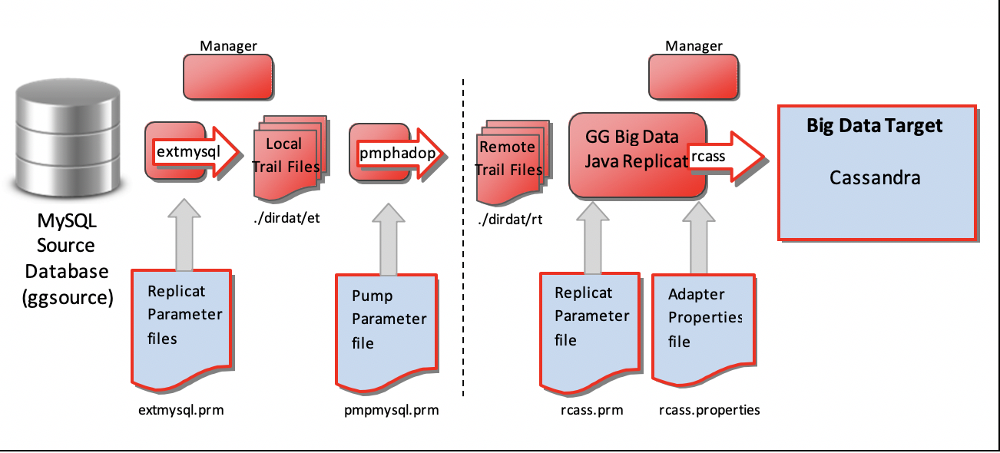

### Objectives
- Explore replication of GoldenGate from **MySQL to Cassandra**

### Prerequisites
This lab assumes you have:
- A Free Tier, Paid or LiveLabs Oracle Cloud account
- SSH Private Key to access the host via SSH
- You have completed:
    - Lab: Environment Setup
    - Lab: Deploy GoldenGate for Big Data

## Task 0: Running your Lab

### Login to Host using SSH Key based authentication
Refer to *Lab Environment Setup* for detailed instructions relevant to your SSH client type (e.g. Putty on Windows or Native such as terminal on Mac OS):
  - Authentication OS User - “*opc*”
  - Authentication method - *SSH RSA Key*
  - OS User – “*ggadmin*”.

1. First login as “*opc*” using your SSH Private Key

2. Then sudo to “*ggadmin*”. E.g.

    ```
    <copy>sudo su - ggadmin</copy>
    ```

 3. Repeat the two steps above to create a second session. These two sessions will be used respectively for `source` and `target` execution tasks

## Task 1: Explore GoldenGate Configuration  
1. In the first or `source` terminal session as user `ggadmin`, type  `labmenu` to display the labmenu IF not at the labmenu.

  **By default ggadmin will automatically start in the labmenu**

  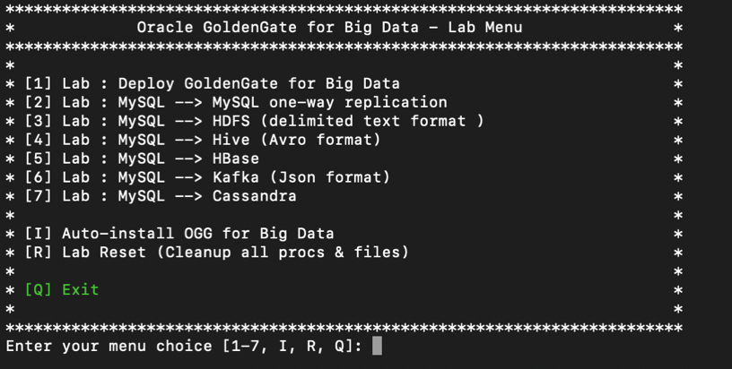

2. Select **R** to reset the lab environment, then select **7**

3. The above step will copy the GoldenGate configuration files to the GG Home directories, under ./dirprm.
  
4. Review the content of each of these files to explore how GoldenGate is being configured.

    ```
    <copy>
    cd /u01/gg4mysql/dirprm
    view /u01/gg4mysql/dirprm/create_mysql_to_hadoop_gg_procs.oby
    </copy>
    ```
    ```
    <copy>view /u01/gg4mysql/dirprm/mgr.prm</copy>
    ```
    ```
    <copy>view /u01/gg4mysql/dirprm/extmysql.prm</copy>
    ```
    ```
    <copy>view /u01/gg4mysql/dirprm/pmpmysql.prm</copy>
    ```
    ```
    <copy> cd /u01/gg4hadoop123010/dirprm</copy>
    ```
    ```
    <copy>view /u01/gg4hadoop123010/dirprm/create_cassandra_replicat.oby</copy>
    ```
    ```
    <copy>view /u01/gg4hadoop123010/dirprm/rcass.prm</copy>
    ```
    ```
    <copy>view /u01/gg4hadoop123010/dirprm/rcass.properties</copy>
    ```

5. Start the Cassandra database server. Open a new ssh session, run the alias as shown below and leave this running until you are done.

    ```
      <copy>startcass</copy>
    ```
Now we need to start the GG manager process on both the source and target. Keep these sessions opened for the rest of this lab.

## Task 2: GoldenGate Source Configuration

1. In the first or `source` terminal session, go to the **GG Home for MySQL**, and start the manager process. You can either cd to the directory, or call the alias ggmysql:

  

    ```
    <copy>
    cd /u01/gg4mysql
    ./ggsci
    </copy>
    ```
    ```
    <copy> info all</copy>
    ```
    ```
    <copy> start mgr</copy>		
     ```
     ```
    <copy> info all</copy>
    ```

2. In the second or `target` terminal session, go to the **GG Home for Hadoop**, and start the manager process. You can either cd to the directory, or call the alias gghadoop:

  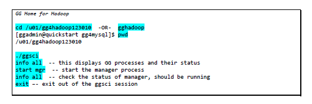

    ```
    <copy>
    cd /u01/gg4hadoop123010
    ./ggsci
    </copy>
    ```
    ```
    <copy> info all</copy>	 
    ```
    ```
    <copy> start mgr</copy>		
    ```
    ```
    <copy> info all</copy>	 
    ```
    ```
    <copy> exit</copy>
    ```

3. In the GG for MySQL ggsci terminal session, we will create and start the GG extract process:

  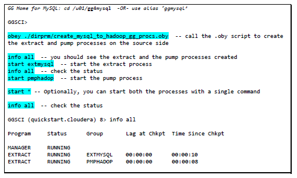

    ```
    <copy>
    cd /u01/gg4mysql
    ./ggsci
    </copy>
    ```
    ```
    <copy>info all</copy>
    ```
    ```
    <copy>start mgr</copy>
    ```
    ```
    <copy>obey ./dirprm/create_mysql_to_hadoop_gg_procs.oby</copy>
    ```
    ```
    <copy>info all</copy>
    ```
    ```
    <copy>start *</copy>
    ```
    ```
    <copy>exit</copy>
    ```

**Note:** ALL parameter files are started in this step

Now that the source side is setup, let us configure GG on the target side (for Cassandra).

## Task 3: GoldenGate Target Configuration

1. In the GG for Hadoop session, you will need to modify the Cassandra properties byremoving the `---` prefixes from the highlighted values::

  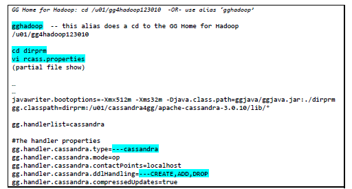
  

    ```
    <copy>
    cd /u01/gg4hadoop123010/dirprm
    vi rcass.properties
    </copy>
    ```

2. Remove "---" from the items below as highlighted above

    ```
    ---cassandra
    ---CREATE,ADD,DROP
    ```

3. Now create and start the Cassandra replicat process:

  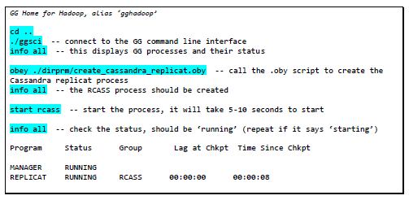

    ```
    <copy>
    cd ..
    ./ggsci
    </copy>
    ```
    ```
    <copy>start mgr</copy>
    ```
    ```
    <copy>info all</copy>		
    ```
    ```
    <copy>obey ./dirprm/create_cassandra_replicat.oby</copy>
    ```
    ```
    <copy>info all</copy>
    ```
    ```
    <copy>start rcass</copy>
    ```
    ```
    <copy>info all</copy>
    ```

## Task 4: Cassandra Replication

Now that GG processes have been created and started on both the source and target, we need to create the Cassandra Keyspace before loading data. A Cassandra Keyspace is equivalent to a database or schema in relational databases. This step can be done at anytime, and is not dependant on GG.

**Note:** If you re-run this lab later, you can run `dropcasskeyspace` to drop the Cassandra keyspace – and then recreate with the alias below.

1. Start a new terminal session as `ggadmin`, then click **Q** to get to a prompt:

  

    ```
    <copy>createcasskeyspace</copy>
    ```

2. Let us check to see if any tables exist in the `ggtarget2cass` Cassandra keyspace. The expected result is an error “`unconfigured table …`” – since the tables have not been created by GG yet. That will be done when GG encounters the first transaction for a new table.

  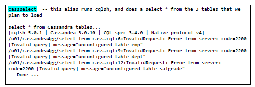

    ```
    <copy>cassselect</copy>
    ```

3. We will load some data on the MySQL database `ggsource` and GG will extract the data, create the Cassandra tables, and write the data to the Cassandra target tables.

4. Start a new terminal session as `ggadmin`, then click **Q** to get to a prompt:

  

    ```
    <copy>mysqlselect</copy>
    ```
    ```
    <copy>loadsource</copy>
    ```
    ```
    <copy>mysqlselect</copy>
    ```

5. Starting with GG version 12.3.0.1.0, GG automatically creates the Cassandra tables. Let us take a look at the contents of the tables:

Ignore message **Cassandra Keyspace already exists**

  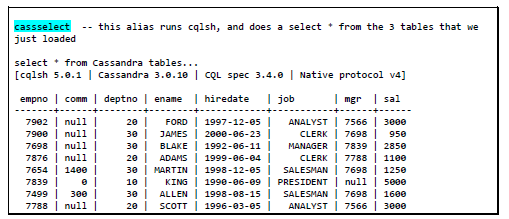
  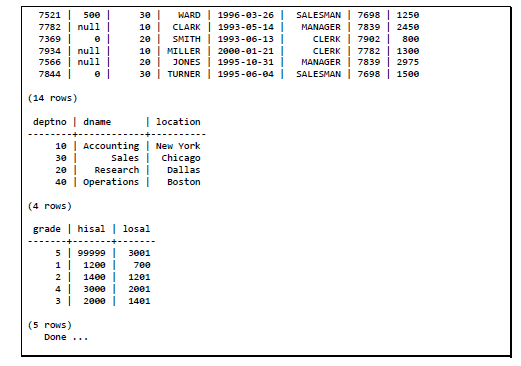

    ```
    <copy>cassselect</copy>
    ```

6. Now we will apply some changes to the source database

  

    ```
      <copy>dmlsource</copy>
    ```

7. Next we will do a count of the Cassandra tables to see if the changes were applied as expected. You can also do a cassselect to see all the data

  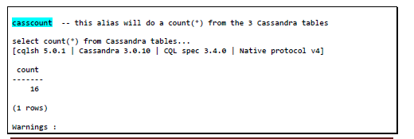
  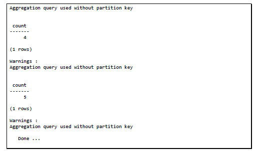

    ```
    <copy>casscount</copy>
    ```

8. Let us confirm using GG to see statistics about data that was replicated In a GG Home for Hadoop session

  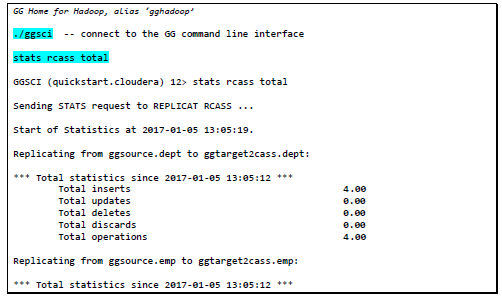
  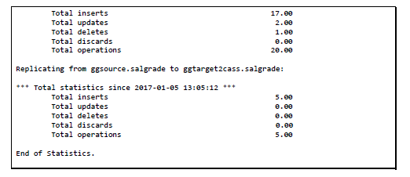

    ```
    <copy>./ggsci</copy>
    ```
    ```
    <copy>stats rcass total</copy>
    ```

## Summary
In summary, you loaded data in MySQL database `ggsource`, GG extract process `extmysql` captured the changes from the MySQL binary logs and wrote them to the local trail file. The pump process
`pmphadop` routed the data from the local trail (on the source) to the remote trail (on the target). The replicat process `rcas’` read the remote trail files, created the Cassandra tables and wrote the data to those tables.

You may now *proceed to the next lab*

## Learn More

* [Oracle GoldenGate for Big Data 19c | Oracle](https://www.oracle.com/middleware/data-integration/goldengate/big-data/)

## Acknowledgements
* **Author** - Brian Elliott, Data Integration Team, Oracle, August 2020
* **Contributors** - Meghana Banka, Rene Fontcha
* **Last Updated By/Date** -  Brian Elliott, Data Integration Team, Oracle, September 2021

