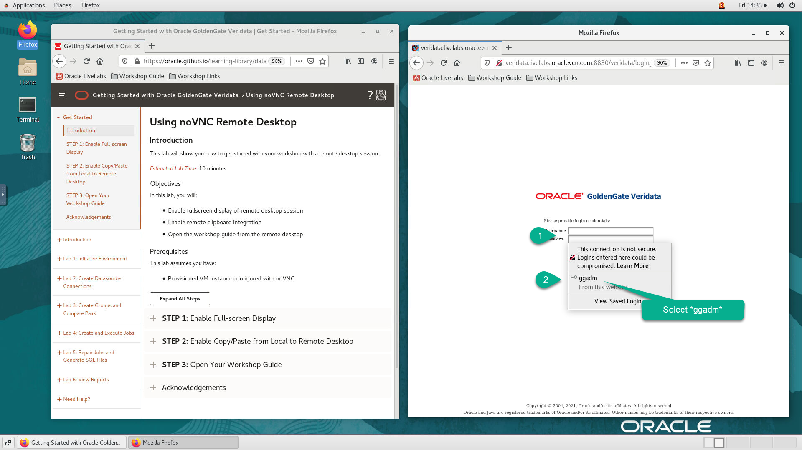
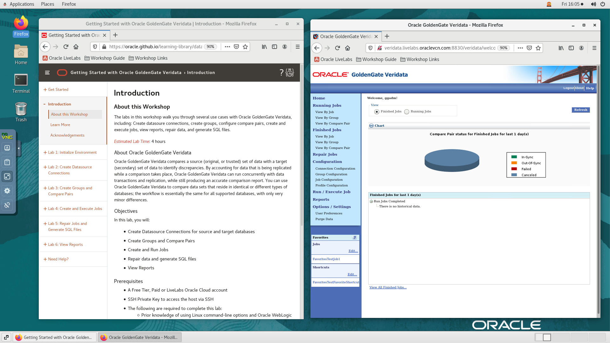
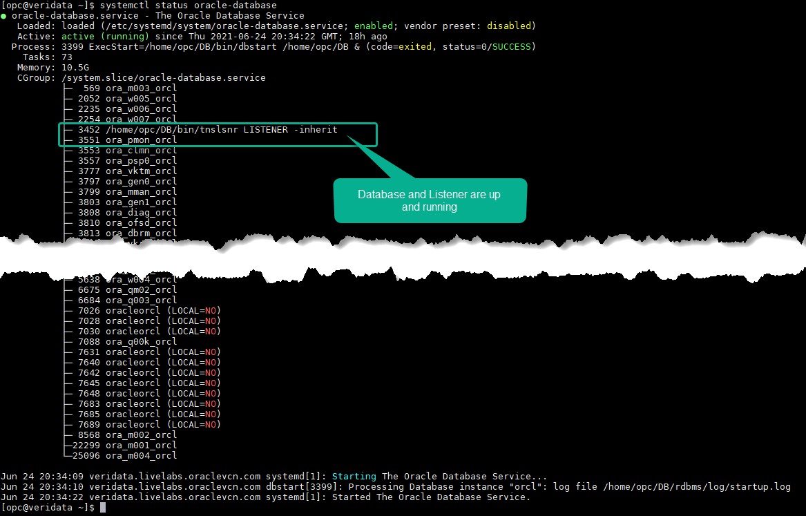

# Initialize Environment

## Introduction

In this lab we will review and startup all components required to successfully run this workshop.

*Estimated Lab Time:* 10 Minutes.

### Objectives
- Initialize the workshop environment.

### Prerequisites
This lab assumes you have:
- A Free Tier, Paid or LiveLabs Oracle Cloud account
- SSH Private Key to access the host via SSH (*Free-tier* and *Paid Tenants* only)
- You have completed:
    - Lab: Generate SSH Keys (*Free-tier* and *Paid Tenants* only)
    - Lab: Prepare Setup (*Free-tier* and *Paid Tenants* only)
    - Lab: Environment Setup

## **STEP 1:** Validate That Required Processes are Up and Running.
1. Now with access to your remote desktop session, proceed as indicated below to validate your environment before you start executing the subsequent labs. The following Processes should be up and running:

    - Database Listener
        - LISTENER
    - Database Server instance
        - ORCL
    - Veridata Server
    - Veridata Agent

2. On the *Firefox* window on the right preloaded with *Veridata*, click on the *Username* field and select the saved credentials to login. These credentials have been saved within *Firefox* and are provided below for reference

    - Username

    ```
    <copy>ggadm</copy>
    ```

    - Password

    ```
    <copy>welcome1</copy>
    ```

    

3. Confirm successful login. Please note that it takes about 5 minutes after instance provisioning for all processes to fully start.

    

    If successful, the page above is displayed and as a result your environment is now ready.  

    You may now [proceed to the next lab](#next).

4. If you are still unable to login or the login page is not functioning after reloading from the *Workshop Links* bookmark folder, open a terminal session and proceed as indicated below to validate the services.

    - Database and Listener
    ```
    <copy>
    sudo systemctl status oracle-database
    </copy>
    ```

    

    - WLS Admin Server, Veridata Server, and Veridata Agent
    ```
    <copy>
    sudo systemctl status oracle-veridata
    </copy>
    ```

    

5. If you see questionable output(s), failure or down component(s), restart the corresponding service(s) accordingly

    - Database and Listener

    ```
    <copy>
    sudo sudo systemctl restart oracle-database
    </copy>
    ```

    - WLS Admin Server, Veridata Server, and Veridata Agent

    ```
    <copy>
    sudo sudo systemctl restart oracle-veridata
    </copy>
    ```

You may now [proceed to the next lab](#next).

## Appendix 1: Managing Startup Services

1. Database Service (Database and Listener).

    - Start

    ```
    <copy>sudo systemctl start oracle-database</copy>
    ```

    - Stop

    ```
    <copy>sudo systemctl stop oracle-database</copy>
    ```

    - Status

    ```
    <copy>sudo systemctl status oracle-database</copy>
    ```

    - Restart

    ```
    <copy>sudo systemctl restart oracle-database</copy>
    ```

2. Veridata Service (WLS Admin Server, Veridata Server, and Veridata Agent)

    - Start

    ```
    <copy>sudo systemctl start oracle-veridata</copy>
    ```

    - Stop

    ```
    <copy>sudo systemctl stop oracle-veridata</copy>
    ```

    - Status

    ```
    <copy>sudo systemctl status oracle-veridata</copy>
    ```

    - Restart

    ```
    <copy>sudo systemctl restart oracle-veridata</copy>
    ```

## Acknowledgements
* **Author** - Anuradha Chepuri, Principal UA Developer, Oracle GoldenGate User Assistance
* **Contributors** -  Nisharahmed Soneji, Sukin Varghese , Rene Fontcha
* **Last Updated By/Date** - Rene Fontcha, LiveLabs Platform Lead, NA Technology, June 2021
