# Create and Modify an APEX Application

## Introduction

In this lab, you will create a new APEX application that will utilize the database objects you created in the previous module. You will then extend the application by adding an Interactive Grid and Calendar pages.

Estimated Time: 20 minutes

### Objectives

- Create an app from a script
- Add an Interactive Grid page and create records
- Enhance the Interactive Grid
- Add a Calendar page

## Task 1: Create an app from a script

In lab 3, step 1, you used Quick SQL to create a script which you subsequently ran to create several tables. The script's Results page has a button that allows you to create a new application based on the script. APEX will parse the script to identify the tables and then create pages in the new app to view and edit data within those tables. In this part, you will create an app based on the script you previously ran.

1. Return to your APEX Workspace. You may need to re-authenticate if your previous session expired. If you need the APEX URL, return to Oracle Cloud, with the Autonomous Database selected, under the Tools tab, click **Open APEX**. To log in, enter **DEMO** for the Workspace and Username fields and **`SecretPassw0rd`** for the password, then click **Sign In**.

   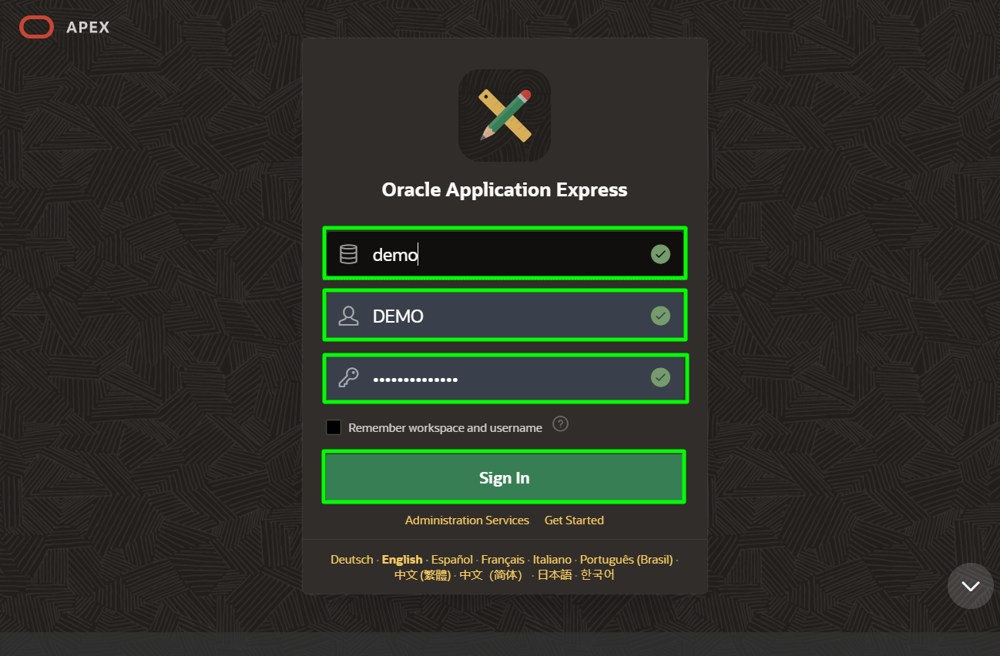

2. Click the down arrow in the **SQL Workshop** tab, then select **SQL Scripts**.

   

3. Click the number link in the Results column to view the results of the previous runs of the script.

   

4. Click the magnifying glass icon in the View Results column.

   

5. On the Results page, click **Create App**.

    In the Create App from Script dialog, click **Create Application**.

   

   *Note: The tables listed are those from the HOL script you created from Quick SQL, and does not include HOL\_TODOS which you created manually using SQL Developer Web.*

6. On the Create an Application page, set Name to **HOL Projects** and then click **Check All** for Features, and then click **Create Application**.

   

   After the app is created, you will be redirected to the application home page in the Application Builder.

7. Click **Run Application** to see the app at runtime.

   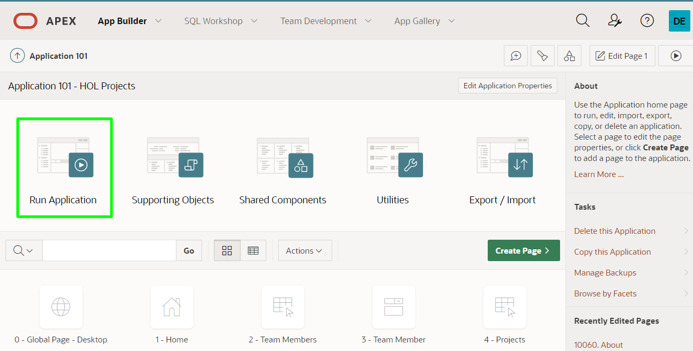

8. Set username to **demo** and password to **`SecretPassw0rd`**, then click **Sign In**.

   

9.  Take a moment to explore the pages that APEX created on top of the tables identified in the script.

   

## Task 2: Add an Interactive Grid page and create records

Thus far, you've used high-level wizards to generate applications, first from a spreadsheet and then from a script. In this part, you will work at a lower level to add a new Interactive Grid page to the application. After that, you will use the new Interactive Grid to add some data to the HOL_TODOS table.

1. Return to the application home page in the Application Builder, then click **Create Page**.

   

2. In the Create a Page dialog, click **Form**.

   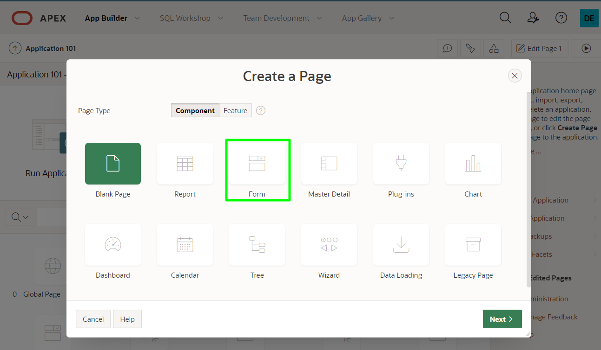

3. In the Create Page dialog, click **Editable Interactive Grid**.

  

4. In the Create Interactive Grid - Page Attributes dialog, for Page Name enter **Todos**, then click **Next**.

  

5. In the Navigation Menu dialog, for Navigation Preference, select **Create a new navigation menu entry**, then click **Next**.

  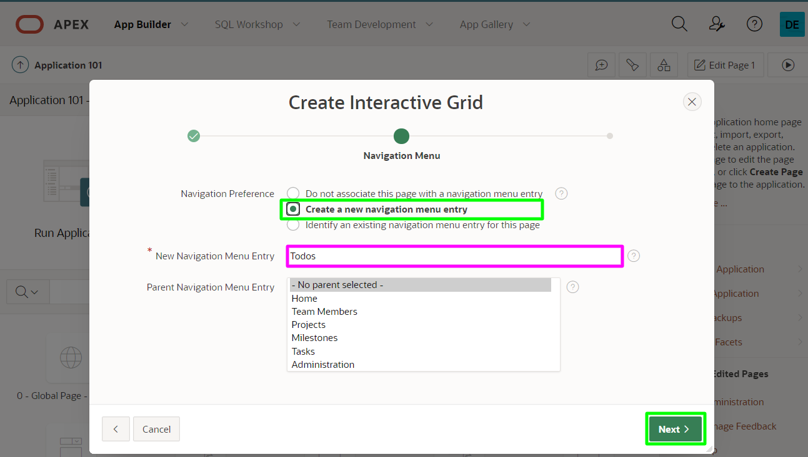

  *Note: The navigation menu entry defaults to the value you entered for Page Name.*

6. In the Report Source dialog, for Table / View Name, select **HOL_TODOS (table)**, then click **Create**.

   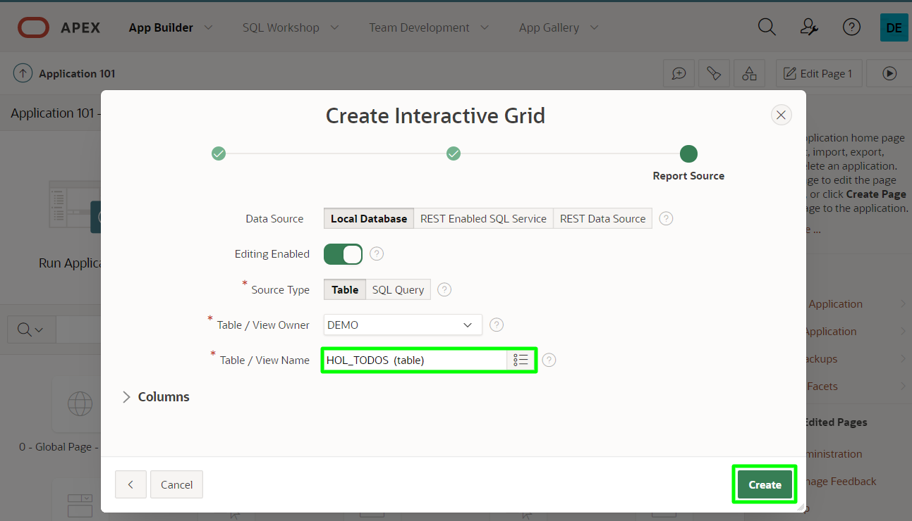

7. After the page is created, you will be redirected to the Page Designer (an IDE like interface) for the new page. To view the runtime for the new page, click the **Save and Run Page** button in the upper right-hand corner.

   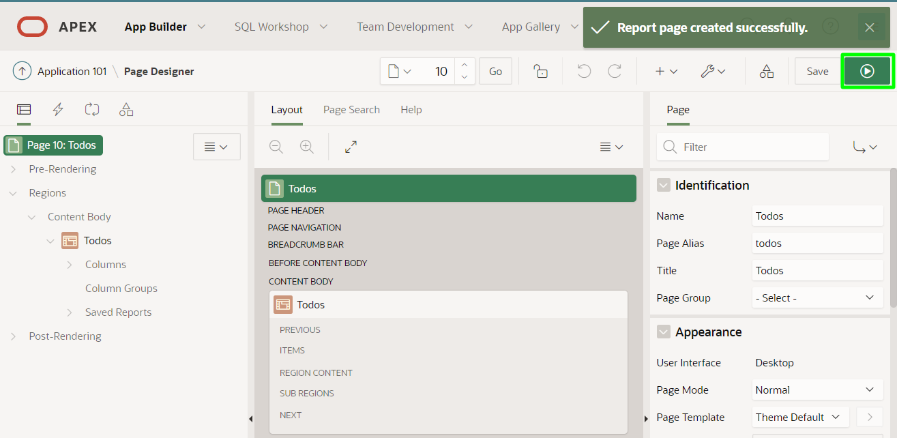

8. The new Interactive Grid page will open in the previous runtime browser tab or window.

   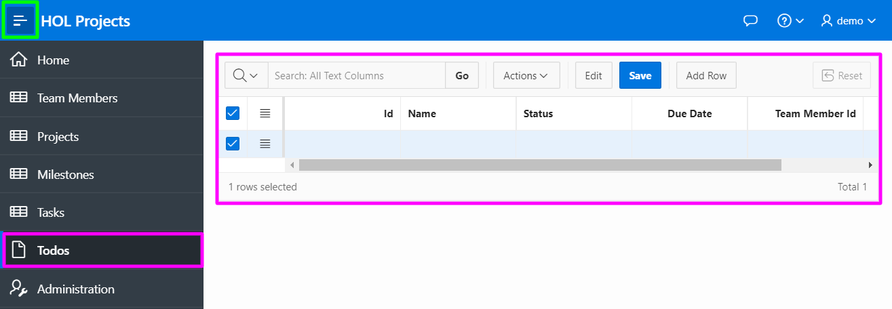

   *Note: A new navigation menu item has been added on the left as well.*

8. Since there is no data in the HOL_TODOS table, the Interactive Grid displays one empty record by default. Use the **Add Row** button to add two more empty rows, populate the columns as follows:

    | Id | Name |
    | --- | --- |
    | **1** | **Fix bugs** |
    | **2** | **Test app** |
    | **3** | **Deploy to production** |

    Click **Save**.

   

   *Note: Don't populate the additional columns yet, you will do that in the next part.*

## Task 3: Enhance the Interactive Grid

A page in APEX is made up of various components, such as regions, items, and buttons. Once created, these components can be configured via the Page Designer. In this part, you will use the Page Designer to make some changes to the Interactive Grid region created in the previous part.

1. At the bottom of the runtime page, you will see the Developer Toolbar (only displayed to developers). Click **Edit Page 10** to return to the Page Designer for page 10 (your page number may be different).

   

2. The Page Designer has three panes, each of which contains different tabs. The default tab in the left pane is the Rendering tab, which displays the various components involved with rendering the page. Expand the columns under the **Todos** region and select **DUE_DATE**. The Property Editor tab in the right pane will display the properties for the selected column. Click the select icon for Format Mask.

    In the Pick Format Mask dialog, click **12-JAN-2004**.

   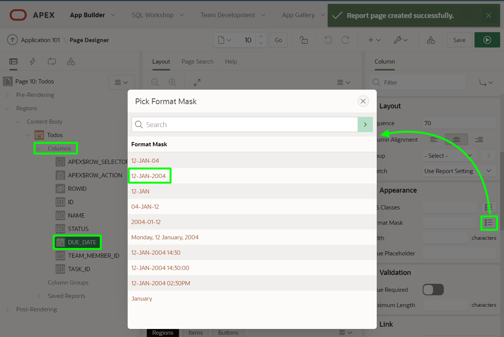

3. When it comes to foreign key columns, it's often best to use a List of Values item that displays one thing to the end user from a lookup table, but returns the foreign key value behind the scenes. This is known as a dynamic list of values. You can define a list of values directly on a page, or define them as a Shared Component that can be used on any page.

    When you generated the application various list of values were created as Shared Components for use on other pages. You can reuse the List of Values defined for **TEAM_MEMBERS**.

    In the Rendering tree (left pane), under Columns, select **TEAM\_MEMBER\_ID**.        
    In the Property Editor (right pane), enter the following:

    - Identification > Type - select **Select List**
    - Heading > Heading - enter **Team Member**
    - List of Values > Type - select **Shared Component**
    - List of Values > List of Values - select **HOL\_TEAM\_MEMBERS.USERNAME**
    - List of Values > Display Extra Values - **Uncheck**

   

4. Unfortunately there is not already a List of Values defined for the HOL_TASKS table. Therefore, you will need to define a list of values using a SQL Statement.

    In the Rendering tree (left pane), under Columns, select **TASK_ID**.        
    In the Property Editor (right pane), enter the following:

    - Identification > Type - select **Select List**
    - Heading > Heading - enter **Task**
    - List of Values > Type - select **SQL Query**
    - List of Values > SQL Query - cut and paste the following

        ```
        <copy>select name d, id r
        from hol_tasks
        order by name</copy>
        ```
    - List of Values > Display Extra Values - **Uncheck**

   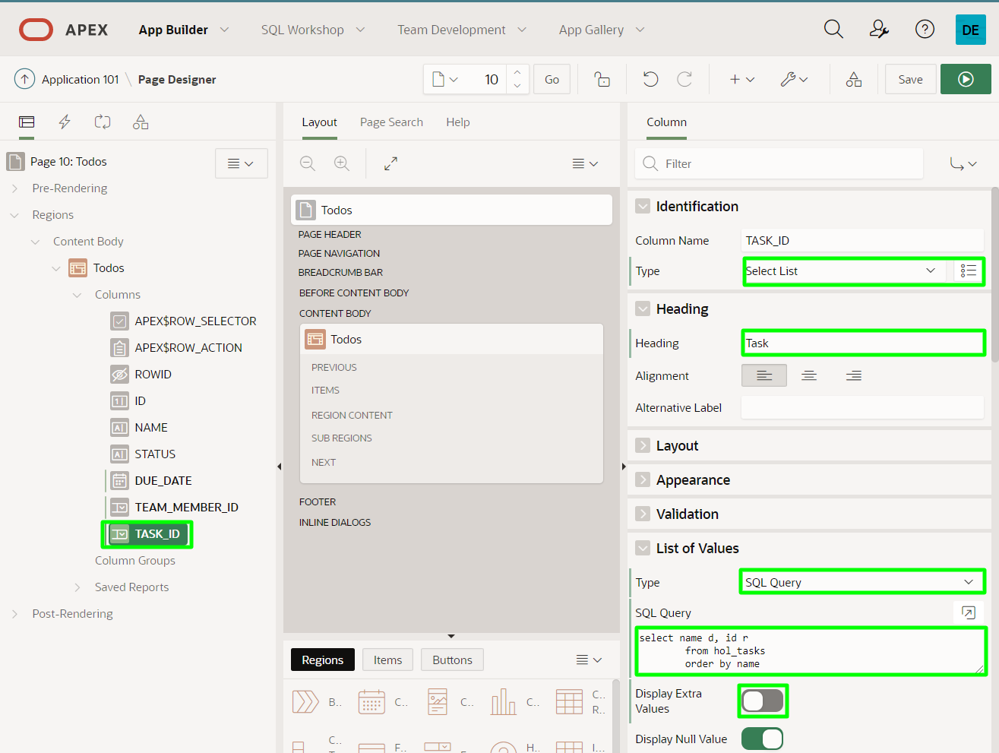

5. In addition to dynamic lists of values, it is sometimes beneficial to create a static list of values to constrain user input to a small set of allowable values. The STATUS column should only allow `Pending`, `In Progress`, or `Complete`.

    In the Rendering tree (left pane), under Columns, select **STATUS**.        
    In the Property Editor (right pane), enter the following:

    - Identification > Type - select **Select List**
    - List of Values > Type - select **Static Values**
    - List of Values > Display Extra Values - **Uncheck**
    - List of Values > Static Values - click **Display1, Display2**     
        In the Static Values dialog enter the following:
        |Display Value|Return Value|
        |---|---|
        |Pending|Pending|
        |In Progress|In Progress|
        |Complete|Complete|

        Click **Ok**.

   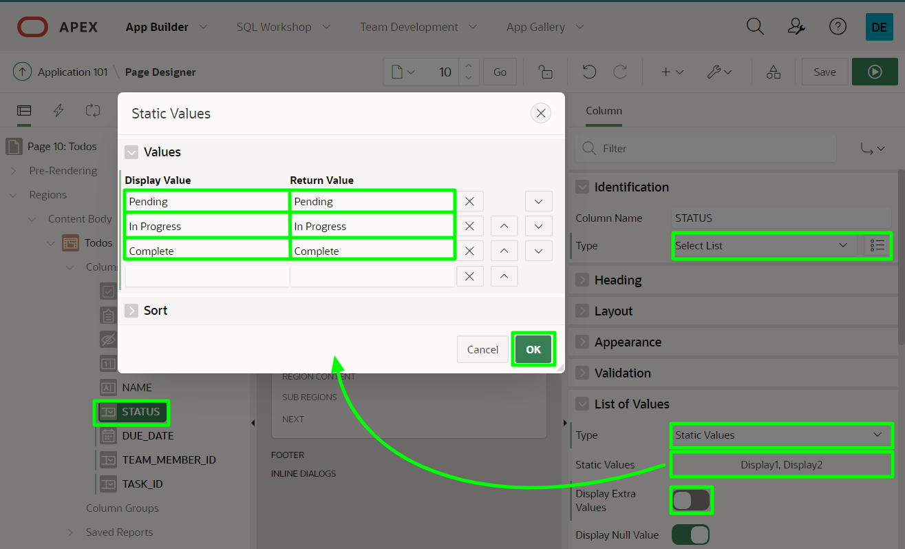

6. In the Page Designer toolbar, click **Save and Run Page**.

   

7. This will re-render the runtime page with the new settings. Try editing the last four columns to see how your updates affected the Interactive Grid.

   

   *Note: The data for Team Members and Tasks is sample data created by Quick SQL, and may not be representative of the names your end users would enter. However, such data is invaluable for seeing data in the pages, and so forth.*

## Task 4: Add a Calendar Page

APEX includes different components for viewing and working with data in different ways, including forms, reports, charts, and much more. One of the easiest ways to visualize data related to dates is with a calendar. In this part, you will create a new calendar page in your application to view data in the HOL\_TASKS table. The HOL\_TASKS table includes both a Start Date and End Date so you could choose to create a duration-based calendar, however, for this lab you are just going to use the Start Date.

1. Click the **Application 102** link (your app number may be different) in the Developer Toolbar. This will return you to the application's home page in the Application Builder.

   

2. From the Application home page, click **Create Page**.

    In the Create a Page dialog, click **Calendar**.

   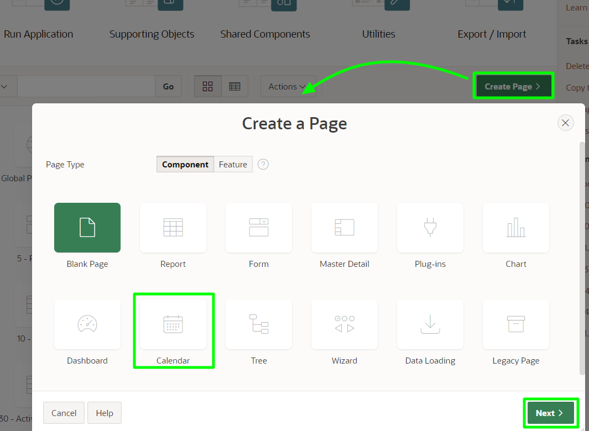

4. In the Create Page - Page Attributes dialog, for Page Name enter **Calendar**, then click **Next**.

   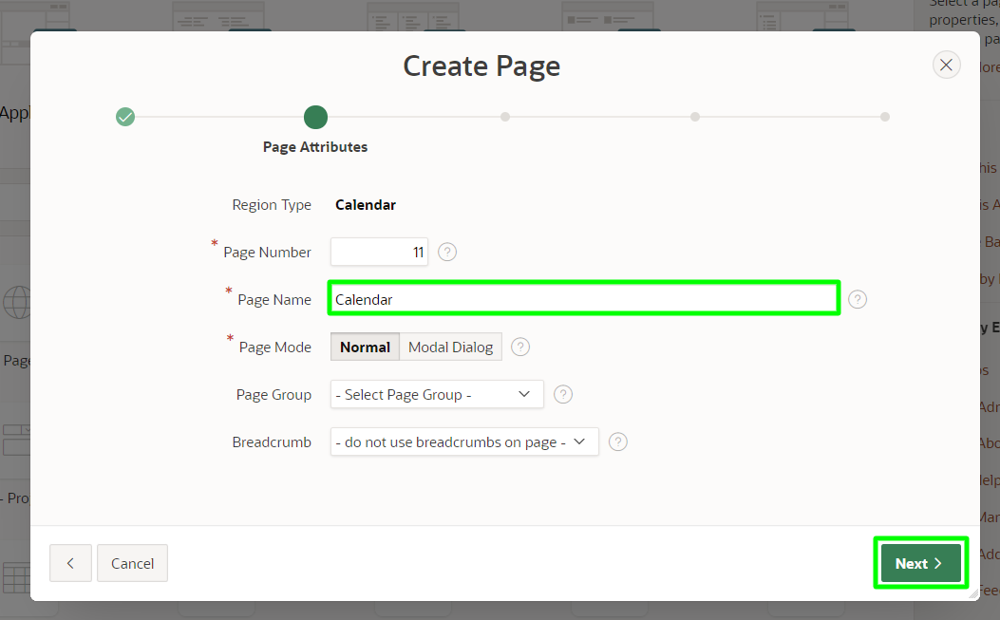

5. In the Navigation Menu dialog, for Navigation Preference, select **Create a new navigation menu entry**. Set Parent Navigation Menu Entry to **Tasks**, then click **Next**.

   

6. In the Source dialog, for Table / View Name, select **HOL_TASKS (table)**, then click **Next**.

   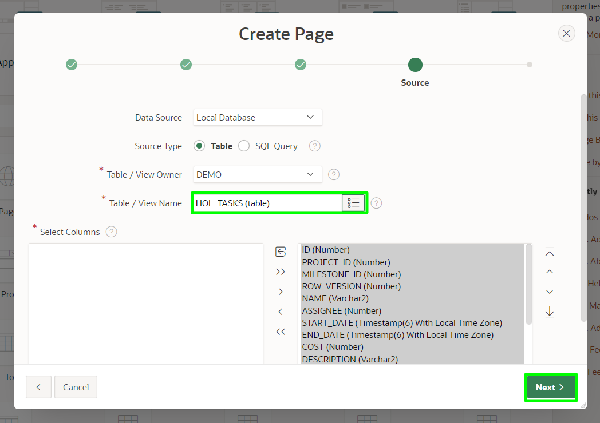

7. In the Settings dialog, for Display Column select **NAME**, then click **Create**.

   

8. After the page is created, you will be redirected to the Page Designer for the new page.         
    In the Page Designer toolbar, click **Save and Run Page** to view the calendar at runtime.

9. Use the arrow buttons to change the months until you see some entries in the calendar. Also, note the new navigation menu entry under **Tasks**.

   

## Summary

You have completed the workshop, well done! At this point you should have a basic understanding of how the Autonomous Transaction Processing service, along with APEX and SQL Developer Web can be used to develop data driven applications with very little code.

## Acknowledgements
* **Author** - Salim Hlayel, Product Manager
* **Contributors** - Oracle LiveLabs QA Team (Jaden McElvey, Technical Lead, Kamryn Vinson, QA Intern, Arabella Yao, Product Manager Intern, DB Product Management)
- **Last Updated By/Date** - Salim Hlayel, Product Manager, September 2021

